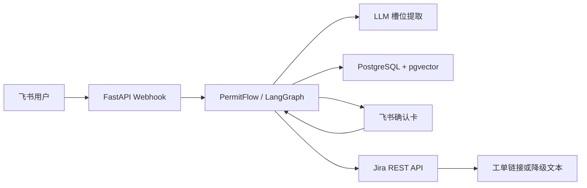

# PermitFlow

PermitFlow 是企业内部权限申请助手。员工在飞书中用中文描述需要的 GitHub、Jira、
CI/CD、监控或云账号权限，服务匹配维护好的权限知识、补齐缺失字段、展示可编辑确认卡，
并在用户确认后创建 Jira 工单。

PermitFlow 只帮助申请：不审批、不执行权限开通，也不允许代他人申请。

## 功能

- LLM 一次完成意图分类与槽位提取，使用 JSON Schema structured output
- 权限名称/别名 ILIKE 精确检索，未命中时使用 pgvector 向量检索
- 内置 20 个高频权限项，覆盖 GitHub、Jira、CI/CD、监控与云账号
- 缺什么问什么，候选项全部列出，确认卡中可直接修改字段
- Jira 创建失败重试 2 次，再降级为预填文本和服务台链接
- LangGraph interrupt 节点与 PostgresSaver 支持
- 未命中记录、权限前提校验、Prometheus 指标与 Jira 状态通知入口
- 管理令牌保护的知识库 CRUD、催办及直属上级代申请接口
- 用户输入 500 字限制、身份防冒用、纯文本转义和最小知识注入边界

## 架构



核心代码位于 `src/permitflow/`：

- `workflow.py`：申请状态流及 LangGraph interrupt 定义
- `knowledge.py`：精确与向量混合检索
- `llm.py`：结构化槽位提取和失败降级
- `cards.py`：候选、确认和结果卡片
- `jira.py` / `feishu.py`：外部系统客户端
- `app.py`：飞书事件、卡片动作、Jira 通知和 metrics HTTP 接口

## 本地启动

要求 Python 3.12+、uv 和 Docker。

```bash
cp .env.example .env
docker compose up -d postgres
uv sync --all-groups
uv run uvicorn permitflow.app:app --reload
```

数据库首次创建时会自动执行 `migrations/`。已有数据卷需要手动执行新增迁移，或在仅本地开发时
删除数据卷后重建。服务默认地址为 `http://localhost:8000`，健康检查为 `/health`。

## 配置

在 `.env` 中配置：

| 变量 | 用途 |
|---|---|
| `DATABASE_URL` | PostgreSQL 连接串 |
| `LLM_BASE_URL` / `LLM_API_KEY` / `LLM_MODEL` | OpenAI 兼容 Chat Completions API |
| `EMBEDDING_BASE_URL` / `EMBEDDING_API_KEY` | 独立的 OpenAI 兼容向量服务 |
| `EMBEDDING_MODEL` / `EMBEDDING_DIMENSIONS` | 向量模型与维度，默认 1536 |
| `FEISHU_APP_ID` / `FEISHU_APP_SECRET` | 飞书应用凭据 |
| `FEISHU_VERIFICATION_TOKEN` | webhook 校验令牌 |
| `JIRA_BASE_URL` / `JIRA_EMAIL` / `JIRA_API_TOKEN` | Jira Cloud 凭据 |
| `IT_SERVICE_DESK_URL` | Jira 失败时的降级入口 |
| `SESSION_TTL_MINUTES` | 会话有效期，默认 30 分钟 |
| `ADMIN_TOKEN` | Phase 3 管理接口令牌 |

飞书配置详见 `docs/feishu-setup.md`，运维说明见 `docs/operations.md`。

## 测试

```bash
uv run ruff check .
uv run pytest
```

CI 在 push 和 pull request 时执行相同检查。

## 阶段边界

Phase 1 提供申请闭环；Phase 2 增加前提校验、未命中记录和指标；Phase 3 提供 Jira webhook
驱动的状态通知接口。状态通知不代表 PermitFlow 参与审批或权限开通。
